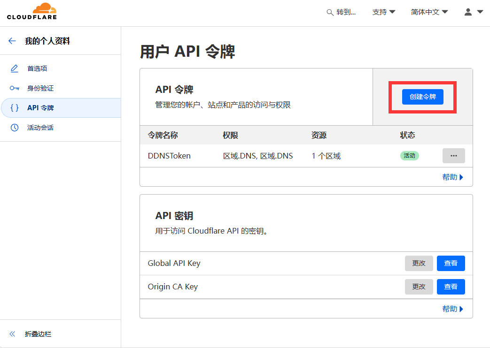
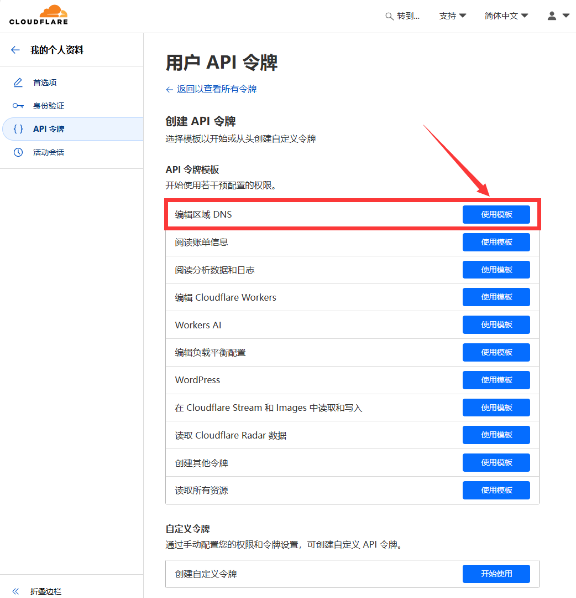
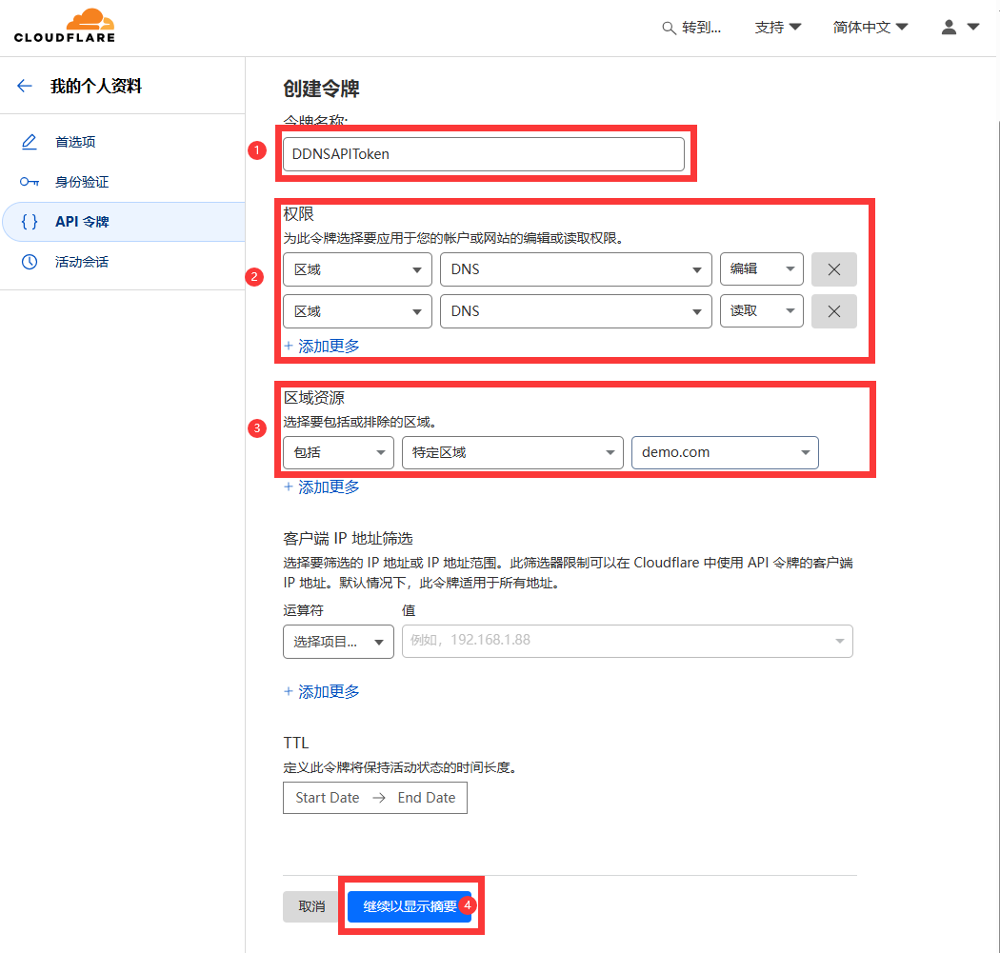
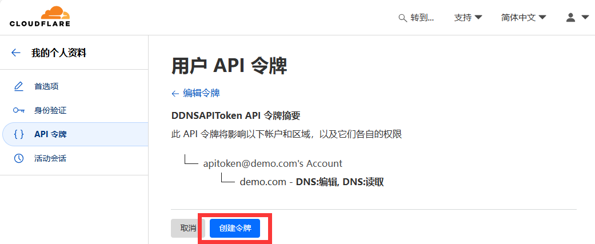

# 🌟 CfDDNS - Cloudflare Dynamic DNS Updater
[](https://github.com/aircross/cfddns/releases)
[](#)
[](#)
##### 这是一个设计用于利用CF的API TOKEN自动更新IP到Cloudflare,实现域名动态更行绑定的的小工具
##### 初衷是因为自己需要将自己家里的IPv6更新到CF，以便于可以快速地通过IPv6访问自己家里的电脑
##### 从一开始的网上找到尝试修改别人的，再到尝试用python手搓，到最后的golang手搓
##### 最终借助ChetGPT，以及到处搜到编写了本小工具
  
🔑 CF_API_TOKEN是你的Cloudflare API token
  
`CF_API_TOKEN`应该是API **token** (_不是_ API key), 你可以在后面的链接处生成 [API Tokens页面](https://dash.cloudflare.com/profile/api-tokens). 通过 **Edit zone DNS** 模板来创建1个 token. 

#### 创建API Token教程如下：
<picture>
  <source media="(prefers-color-scheme: dark)" srcset="./assets/images/api-tokens-1.png">
  
</picture>
<picture>
  <source media="(prefers-color-scheme: dark)" srcset="./assets/images/api-tokens-2.png">
  
</picture>
<picture>
  <source media="(prefers-color-scheme: dark)" srcset="./assets/images/api-tokens-3.png">
  
</picture>
<picture>
  <source media="(prefers-color-scheme: dark)" srcset="./assets/images/api-tokens-4.png">
  
</picture>

#### 待办事项，也可能会是一直待办，抱歉我懒:
1. 增加日志功能
2. 增加调试模式，只有调试模式才打印执行日志到控制台，否则后台运行
3. 增加日志功能
4. 修复WIndows增加系统服务功能
5. 优化到无需指定ZoneID，这个比较麻烦，所以你懂得
6. 增加docker编译，方便群晖之类设备的直接拉取运行
  
#### 使用说明如下：
```shell
CfDDNS  -  Cloudflare  Dynamic  DNS  Updater
  
Usage:
 cfddns [command] [arguments]
  
Commands:
  tgtest              Send a test message to the configured Telegram chat.
  now                 Query and display the current DNS record IP for the domain.
  v4 <IPv4>           Update the domain's IPv4 DNS record to the specified IPv4 address.
  v6 <IPv6>           Update the domain's IPv6 DNS record to the specified IPv6 address.
  v, ver, version     Show the program version.
  h, help             Show this help message and exit.
Todo:
  s, service [name]   Set up the program as a system service. Default service name: cfddns.
  rs, removeservice [name]
                      Remove the specified system service. Default service name: cfddns.
  
Examples:
  cfddns              Run the program with the default configuration (dynamic DNS update).
  cfddns tgtest       Send a test message via Telegram.
  cfddns now          Display the current IP address associated with the DNS record.
  cfddns v4 192.0.2.1 Update the domain's A record to 192.0.2.1.
  cfddns v6 2001:db8::1 Update the domain's AAAA record to 2001:db8::1.
  cfddns version      Show the program version.
  cfddns help         Show this help message.
Todo:
  cfddns s            Configure the program as a system service with the default name 'cfddns'.
  cfddns rs           Remove the program's system service with the default name 'cfddns'.
  cfddns rs myservice Remove the system service named 'myservice'.
  
Notes:
  - For commands like 'v4' and 'v6', the IP address must be valid, or an error will be shown.
  - Ensure the configuration file is properly set up before running the program.
  - system service Requires administrative privileges.
  - Services are registered differently on Windows and Linux.
  - Remove system service operation prompts if the service does not appear to be created by this program.
```

## 支持的操作系统

- Ubuntu 20.04+
- Debian 11+
- CentOS 8+
- OpenEuler 22.03+
- Fedora 36+
- Arch Linux
- Parch Linux
- Manjaro
- Armbian
- AlmaLinux 8.0+
- Rocky Linux 8+
- Oracle Linux 8+
- OpenSUSE Tubleweed
- Amazon Linux 2023
- Windows x64

## 支持的架构和设备
<details>
  <summary>点击查看 支持的架构和设备</summary>

我们的平台提供与各种架构和设备的兼容性，确保在各种计算环境中的灵活性。以下是我们支持的关键架构：

- **amd64**: 这种流行的架构是个人计算机和服务器的标准，可以无缝地适应大多数现代操作系统。

- **x86 / i386**: 这种架构在台式机和笔记本电脑中被广泛采用，得到了众多操作系统和应用程序的广泛支持，包括但不限于 Windows、macOS 和 Linux 系统。

- **armv8 / arm64 / aarch64**: 这种架构专为智能手机和平板电脑等当代移动和嵌入式设备量身定制，以 Raspberry Pi 4、Raspberry Pi 3、Raspberry Pi Zero 2/Zero 2 W、Orange Pi 3 LTS 等设备为例。

- **armv7 / arm / arm32**: 作为较旧的移动和嵌入式设备的架构，它仍然广泛用于Orange Pi Zero LTS、Orange Pi PC Plus、Raspberry Pi 2等设备。

- **armv6 / arm / arm32**: 这种架构面向非常老旧的嵌入式设备，虽然不太普遍，但仍在使用中。Raspberry Pi 1、Raspberry Pi Zero/Zero W 等设备都依赖于这种架构。

- **armv5 / arm / arm32**: 它是一种主要与早期嵌入式系统相关的旧架构，目前不太常见，但仍可能出现在早期 Raspberry Pi 版本和一些旧智能手机等传统设备中。
</details>
